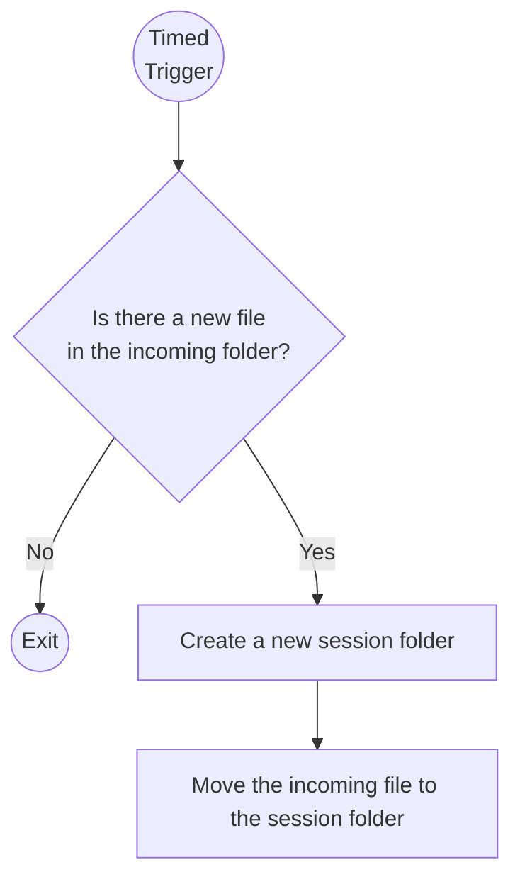
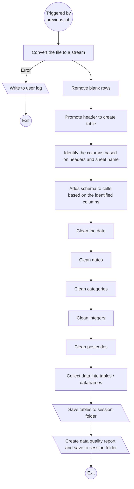
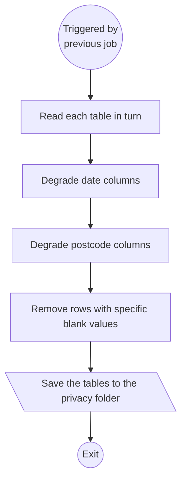

# Annex A: Pipeline

The Annex A pipeline can only process one Annex A file at a time. This is a single Excel file with multiple sheets.

The upload process should ideally only allow for one file at a time. No additional metadata is required.

The overall flow of the pipeline is as follows:

1. Prepfile - move file and collect metadata
2. Cleanfile - ensure file is in a consistent format
3. Apply Privacy Policy - degrade data to meet data minimisation rules
4. History 1 - Archive data
5. History 2 - Rollup data
6. History 3 - Remove old data
7. Client reports
8. Prepare shareable reports


## Annex A - Prepfile

Moves an incoming file to a session folder and removes from incoming.

Inputs:
  * A single .xlsx or .xlsm file containing the multiple Annex A sheets

Outputs:
  * Creates a new session folder containing the incoming file

```
session-<timestamp>/
├── incoming-annex-a.xlsx
└── logs/
    ├── user.log
    └── error.log
```

Process:

* **1:** Is there a new file in the incoming folder?
    * **1.1:** Yes: Continue to 2
    * **1.2:** No: Exit
* **2:** Create a new session folder
* **3:** Move the incoming file to the session folder





## Annex A - Cleanfile

Cleans the incoming file by normalising column headers and data types, and saves sheets as individual CSV files.

This process uses the stream parser (in future SFDATA) and therefore has to run
as a single dagster operation.

Inputs:
  * Session folder with incoming Annex A file

Outputs:
  * Adds clean csv tables to session folder

  ```
session-<timestamp>/
├── incoming-annex-a.xlsx
├── clean-annex-a/
│   ├── annex-a-list-1.csv
│   ├── annex-a-list-2.csv
│   └── ... etc
└── logs/
```

Process:

* **1:** Convert the file to a stream
  * **1.1:** If error occurs, write to user log and error log then exit
* **2:** Remove blank rows
* **3:** Promote header to create table
* **4:** Identify the columns based on headers and sheet name
* **5:** Adds schema to cells based on the identified columns
* **6:** Clean the data
  * **6.1:** Clean dates
  * **6.2:** Clean categories
  * **6.3:** Clean integers
  * **6.4:** Clean postcodes
* **7:** Collect data into tables / dataframes
* **8:** Save tables to session folder
* **9:** Create data quality report and save to session folder

Questions:
* Do we want to create a "cleaned" Annex A excel for the user folder? 



## Annex A - Apply Privacy Policy

Working on each of the tables in turn, this process will degrade the data to meet data minimisation rules:
  * Dates all set to the first of the month
  * Postcodes all set to the first 4 characters (excluding spaces)
  * Some tables need rows deleted if there are blanks in a specific column

**WARNING:** This assumes all of this code will be re-written to run in pandas
instead of using the stream parser. This should have minimal impact as the functions are reusable.

Inputs:
  * Session folder with individual table CSV files

Outputs:
  * Adds privacy minimised csv tables to session folder

```
session-<timestamp>/
├── incoming-annex-a.xlsx
├── clean-annex-a/
├── privacy-annex-a/
│   ├── annex-a-list-1.csv
│   ├── annex-a-list-2.csv
│   └── ... etc
└── logs/
```

Process:

* **1:** Read each table in turn from the session folder making sure to use schema information to set the data types
* **2:** Degrade date columns - based on the schema find date columns that require degradation and degrade them
* **3:** Degrade postcode columns - based on the schema find postcode columns that require degradation and degrade them
* **3:** Remove rows with blank values in specific column: based on the schema filter the current table where there are nulls in the protected columns
* **4:** Save the tables to the privacy folder




## Annex A - History 1 - Archive data

The purpose of this set of jobs is to create a historic view of all the data that has been uploaded. There is however a retention policy that sets a limit on how much historic data is kept.

This job keeps a copy of every uploaded file and merges these, then deduplicates by only retaining the most recent record for each table row.

This process is structured so that an archive of the history data is preserved in case of data corruption, and should allows the steps to be re-run to build as much
history as is retained.

Inputs:
  * Session folder with individual table CSV files

Outputs:
  * History folder if it does not exist
  * Timestamped folder with current data

```
history-annex-a/
├── 2021-01-01-12-00-00/
│   ├── snapshot
│   │   ├── annex-a-list-1.csv
│   │   ├── annex-a-list-2.csv
│   │   └── ... etc
└── ... etc
```

Process:
  * Create history folder if it does not exist
  * Create timestamped folder and substructure
  * Copies current tables to timestamped folder

## Annex A - History 2 - Rollup data

This is designed to maximise chances of recovering from data corruption. We have a
set of snapshot data. Some of these may contain history rollup files. We will not 
touch rollup files if they exist. It will be a manual job to clean up any corrupted data. This job will create rollup files where needed, but if a rollup
file already exists, subsequent rollups will use this.

Inputs:
  * History folder with timestamped folders
  * Retention configuration (years to retain)

Outputs:
  * Rollup (history) folders in each timestamp folder
  * A current folder with the most recent rollup

```
history-annex-a/
├── current/
│   ├── annex-a-list-1.csv
│   ├── annex-a-list-2.csv
│   └── ... etc
├── 2021-01-01-12-00-00/
│   ├── snapshot
│   │   ├── annex-a-list-1.csv
│   │   ├── annex-a-list-2.csv
│   │   └── ... etc
│   └── history
│       ├── annex-a-list-1.csv
│       ├── annex-a-list-2.csv
│       └── ... etc
└── ... etc
```

Process:
  * Starting at the beginning, for each timestamped folder:
    * For each table:
        * Does the folder contain a history file for this table?
            * Finds the previous history folder
                * Concatenates the current tables with the previous history tables
                * Deduplicates the full tables preserving the last record for each row
            * Applies the retention policy to the full tables
            * Saves the full tables to the history folder
  * Copies the rollup data for the last timestamped event to the 'current' folder.

## Annex A - Client reports

Based on the current data, this process creates a set of reports for each client. These are saved to the client folder.

## Annex A - Prepare shareable reports

This process creates a set of reports for each client that can be shared with the Pan London group.

These reports are the same as the client reports with two added columns:
  * LA Child ID
  * LA Name

There could also be additional data retention/sharing policies applied here

Copy to the "shared" folder for each client - this is a folder to which
the pan london central account has access.

## Annex A - Data Retention 1

This process removes old timestamp folders from historic data. It is designed to be run after the rollup process or periodically and can clean either based on a time period, or the number of snapshots we wish to retain.

## Annex A - Data Retention 2

This process removes old session folders. It is designed to be run periodically and can clean either based on a time period, or the number of snapshots we wish to retain.
