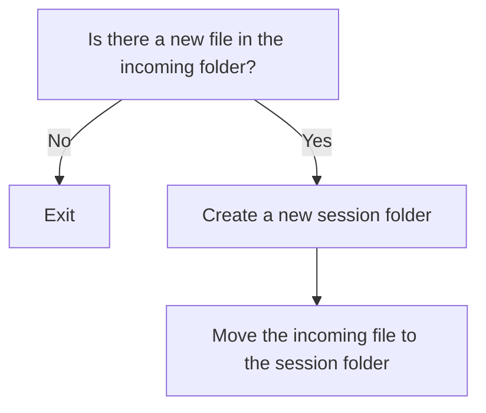
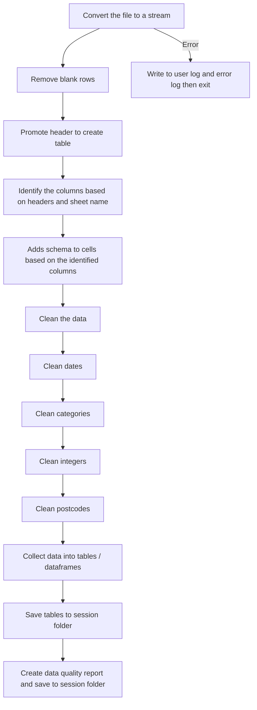

# Annex A: Pipeline

The Annex A pipeline can only process one Annex A file at a time. This is a single Excel file with multiple sheets.

The upload process should ideally only allow for one file at a time. No additional metadata is required.


## Annex A - Prepfile

Moves an incoming file to a session folder and removes from incoming.

Inputs:
  * A single .xlsx or .xlsm file containing the multiple Annex A sheets

Outputs:
  * Creates a new session folder containing the incoming file

```
session-<timestamp>
├── incoming-annex-a.xlsx
└── logs/
    ├── user.log
    └── error.log
```

Process:

* **1:** Is there a new file in the incoming folder?
    * **1.1:** Yes: Continue to 2
    * **1.2:** No: Exit
* **2:** Create a new session folder
* **3:** Move the incoming file to the session folder





## Annex A - Cleanfile

Cleans the incoming file by normalising column headers and data types, and saves sheets as individual CSV files.

This process uses the stream parser (in future SFDATA)

Inputs:
  * Session folder with incoming Annex A file

Outputs:
  * Adds clean csv tables to session folder

  ```
session-<timestamp>
├── incoming-annex-a.xlsx
├── clean-annex-a/
│   ├── annex-a-list-1.csv
│   ├── annex-a-list-2.csv
│   └── ... etc
└── logs/
    ├── user.log
    └── error.log
```

Process:

* **1:** Convert the file to a stream
  * **1.1:** If error occurs, write to user log and error log then exit
* **2:** Remove blank rows
* **3:** Promote header to create table
* **4:** Identify the columns based on headers and sheet name
* **5:** Adds schema to cells based on the identified columns
* **6:** Clean the data
  * **6.1:** Clean dates
  * **6.2:** Clean categories
  * **6.3:** Clean integers
  * **6.4:** Clean postcodes
* **7:** Collect data into tables / dataframes
* **8:** Save tables to session folder
* **9:** Create data quality report and save to session folder

Questions:
* Do we want to create a "cleaned" Annex A excel for the user folder? 



## Annex A - Degrade

Working on each of the tables in turn, this process will degrade the data to meet data minimisation rules:
  * Dates all set to the first of the month
  * Postcodes all set to the first 4 characters (excluding spaces)

Inputs:
  * Session folder with individual table CSV files

Outputs:
  * Adds clean csv tables to session folder

```
session-<timestamp>
├── incoming-annex-a.xlsx
├── clean-annex-a/
│   └── ... etc
├── degrade-annex-a/
│   ├── annex-a-list-1.csv
│   ├── annex-a-list-2.csv
│   └── ... etc
└── logs/
    ├── user.log
    └── error.log
```

Process:

* **1:** 


